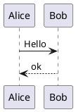
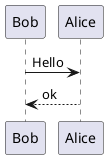
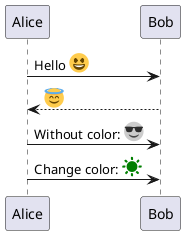

## title

### 1st

```plantuml
@startuml
Alice->Bob : Hello
return ok
@enduml
```

### 2nd

```plantuml
@startuml
Bob->Alice : Hello
return ok
@enduml
```

### 3rd

```plantuml
@startuml
Alice -> Bob : Hello <:1f600:>
return <:innocent:>
Alice -> Bob : Without color: <#0:sunglasses:>
Alice -> Bob : Change color: <#green:sunny:>
@enduml
```
